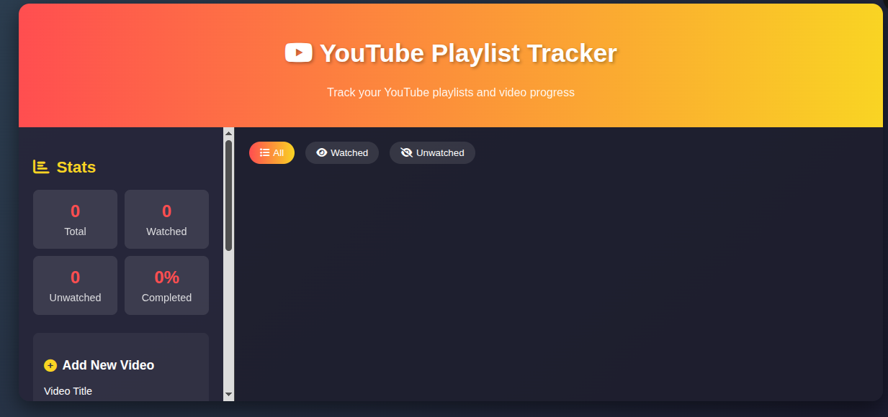

---
# 🎬 YouTube Playlist Tracker

A simple, lightweight web app to **track your YouTube playlists and video progress**.
Perfect for staying focused while studying, learning, or managing long playlists.

---

## ✨ Features

- 📊 **Stats Dashboard**

  - Total videos, watched count, unwatched count, and completion percentage.

- ➕ **Add New Videos**

  - Enter a title, YouTube URL, and duration.
  - Automatically added with a thumbnail, duration, and timestamp.

- ✅ **Track Progress**

  - Mark videos as watched.
  - Progress bar updates dynamically.

- 🔍 **Filter Options**

  - View all, watched, or unwatched videos.

- 💾 **Save & Load Playlist**

  - Save your progress to local storage.
  - Reload playlists anytime.

- 🗑 **Manage Videos**

  - Open video directly on YouTube.
  - Remove videos from playlist.

---

## 🚀 Getting Started

1. Clone the repository:

   ```bash
   git clone https://github.com/Kaucodes/Youtube-playlist-tracker.git
   ```

2. Navigate to the project folder and open `Tracker.html` in your browser.

   > 💡 No backend or server required — it runs completely offline.

---

## 🛠 Tech Stack

- **HTML5**
- **CSS3**
- **JavaScript (Vanilla)**
- **Font Awesome Icons**

---

## 📌 Usage

1. Add videos with title, URL, and duration.
2. Mark as watched/unwatched to track study progress.
3. Save your playlist to local storage for later use.

---

## 📷 Demo

Here’s how it looks in action:



---

## 💡 Future Improvements

- Export/import playlists as JSON files.
- Dark/light mode toggle.
- Sorting by duration, date added, or title.
- Sync progress across devices (cloud support).

---

## 📜 License

## License

This project is licensed under the **MIT License** – see the [LICENSE](LICENSE) file for details.

---
